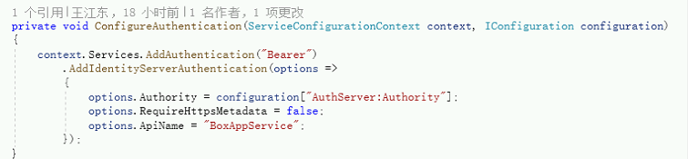
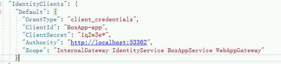
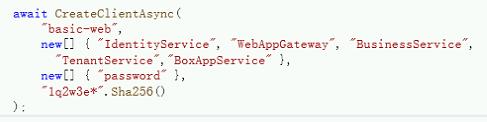

# 路线图

## 目的：验证微服务权限验证，微服务内获取身份信息，服务间调用等，从而确认微服务的基础知识。

以 ABP-MicroService 为基础，在 Dev02 分支中分步实施，验证成功后勾选，并标记注意事项。[^1]

- [x] 添加BoxApp服务。[^2]
- [x] BoxApp的test服务添加权限限制
- [x] BoxApp打包发布nuget[^3]
- [x] 将新服务添加至微服务中[^4]
- [x] 修改前端Vue添加BoxApp服务调用[^5]
- [x] 启动服务验证权限成功 [^6]
- [x] BoxApp服务添加Box实体，并完成配套crud功能，添加权限。
- [x] BoxApp重新打包发布nuget。BaseService更新nuget包 [^7]
- [x] 启动服务验证权限成功。证明新建服务具备完整权限功能
- [ ] 前端 Vue 添加页面，并完成基础功能（curd）。
- [ ] 微服务内获取用户身份信息，并进一步改造 BaseServices 向 Claim 添加自定义身份信息
- [ ] 微服务间相互调用
- [ ] 微服务间通过 EventBus 发布、订阅。实现应用的提交、实现分离，提升复杂应用的处理效率。
- [ ] 进一步了解 Vue 前端基础知识，弄清 Vue 与 Vnext 配套的身份验证部分。
- [ ] 深入了解 Vue 框架知识，重点是 Route、模块通信
- [ ] Vue 进阶，尝试通过后台 swagger 的 json 生成 ts 模型

---
## 实施纪要

 [^1]: 启动实施。 2020/12/1
 [^2]: 参照Business创建服务BoxApp 2020/12/1
 [^3]: 发布至192.168.168.170:8081 ，发布Domain、Application.Contracts、HttpApi 3个包，注意修改版本号
 [^4]: BoxApp添加IdentityClients 修改appsettings.json ;WebAppGateway添加api指向 修改appsettings.json；AuthServer添加client认证 修改AuthServerDataSeeder；BaseService添加权限及接口至系统，Application.Contracts 和Host项目分别添加引用BoxApp的nuget包 
 ***注意：***
 BoxApp的服务名ApiName 
 BoxApp的client名  
 AuthServer的basic-web也要添加引用 
 2020/12/1
 [^5]: views下添加boxapp，router下修改菜单index.js 
 url不需填写BoxApp 的地址，直接使用WebAppGateway的即可，Gateway会指向服务地址 "/api/boxapp/box"
 2020/12/1
 [^6]: 因为添加了新clinet，旧的登录token无法识别，需要退出重新登录。验证token的地址http://jwt.calebb.net/  2020/12/1
 [^7]: 注意升级版本号。  2020/12/2