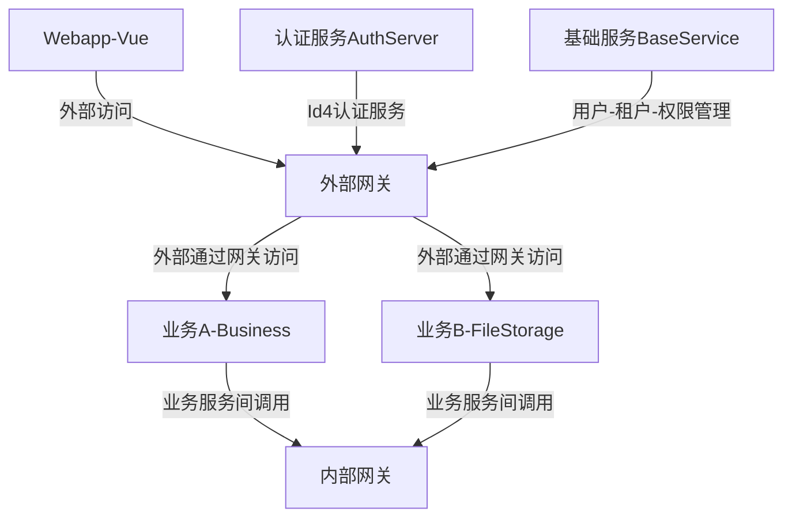

###微服务结构图
***随时更新***

---
###微服务结构说明
- 外部网关
    - 网关服务：Ocelot
    - 特性：对外屏蔽业务服务实现。Webapp只知道外部网关地址，网关（配置ReRoutes）将url指向背后的业务服务。
    - 深入：服务可以负载均衡（DownstreamHostAndPorts配置多个结点）、聚合（Aggregates）、熔断（QosOptions）；网关可以集群，可以与Consul配合实现服务发现
- 内部网关
内部业务服务间相互调用，需通过内部网关。确保不与外部接触。
***注意：***内部网关访问，只对服务不对用户，也就是权限限制仅到单个服务（注册的服务名）。
- AuthServer
目前认识：“认证服务”，集成IdentityServer4，所有服务都需要在这里认证（服务名、client-id、密码）
- BaseService
目前认识：“基础服务”，包含用户管理、租户管理、权限管理等。
- 业务A-Business
目前包含“系统工具”中表单管理等功能实现（通过module模式）
- 业务B-FileStorage
文件上传功能，暂无权限认证，最好只注册内部网关、不注册外部网关，作为内部服务被其他对外提供服务的业务调用。